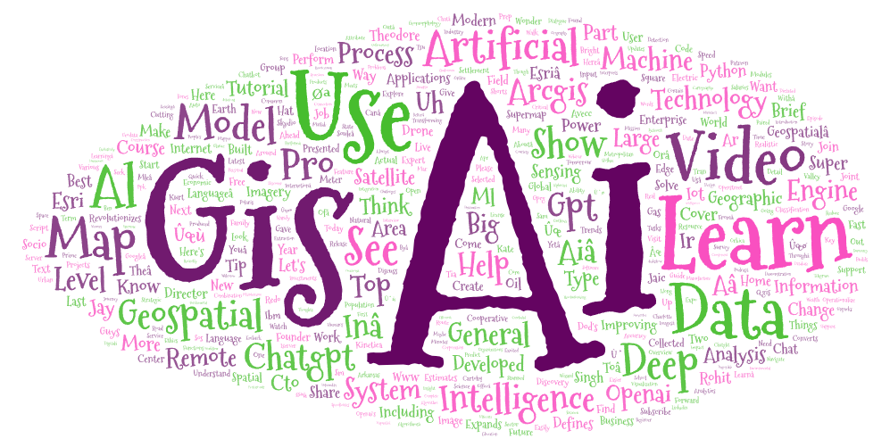
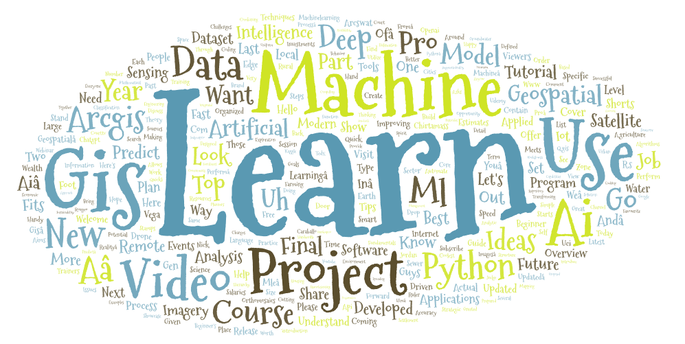

# geog458_Lab2

## Narrative

The topic I decided to use in my search was the involvement of AI in GIS. The search parameter I used in my first search results are:
"GIS and AI", "AI in Geography", and "AI in GIS". My second search parameters were "GIS machine learning applications", "Machine learning for spatial analysis", and "GIS and ML projects". Essentially, my search parameters were split into AI and machine learning. 
I wanted to compare the two because searching GIS and Machine learning might focus on specific applications and case studies while Gis and AI might provide a broader overview of AI in a GIS context.

Looking at the two word clouds, their most common words mostly correspond to their respective topics: AI and Machine Learning. The AI word cloud had words such as "ChatGPT", "artificial", and "intelligence". The machine learning word cloud focused and words such as "machine", "project", and "python". My predictions on what the word clouds could contain were mostly correct, with the AI word cloud having words that cover a broader overview of the topic and the machine learning word cloud having results that has practical applciations such as "project", "python", and even "course".

One way this research could be improved in the future is to expand platforms used. Instead of just Youtube, we could also utilize Twitter, Instagram, or even articles. 

Something that stood out to me in the maps were how little they seemed to overlapped on words.

[Download Search Result 1](assets/search-result-1.csv)
[Download Search Result 2](assets/search-result-2.csv)